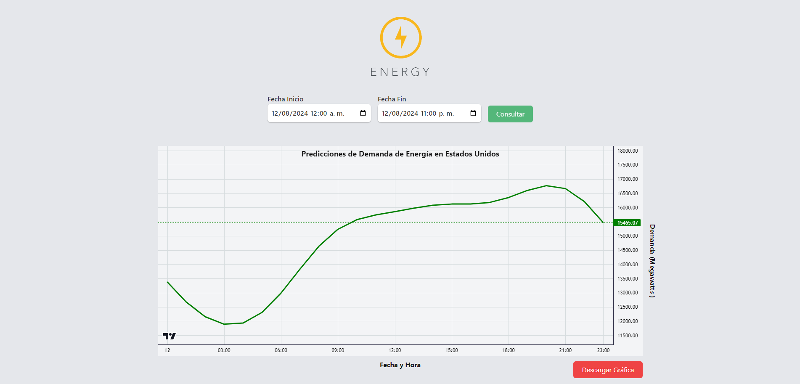

# Proyecto de Predicción de Energía en los Estados Unidos
Este proyecto es una aplicación web que predice la demanda de energía en los Estados Unidos. Utiliza un modelo de predicción entrenado con un dataset de más de 100,000 datos históricos.



## Características
- **API Python:** La API, desarrollada en Python, se encarga de realizar las predicciones utilizando un modelo de Machine Learning.
- **Frontend ReactJS:** La interfaz de usuario está construida con ReactJS utilizando Vite para un desarrollo rápido y eficiente.
- **Predicción Precisa:** El modelo ha sido entrenado con un extenso dataset para proporcionar predicciones precisas de la demanda energética.

### Otras características
1. Recopilación de datos de consumo de energía desde archivo .csv
2. Limpieza y preprocesamiento de datos.
3. Análisis exploratorio de datos (EDA).
4. Entramientode un modelo de predicción utilizando Prophet.
5. Evaluación del rendimiento del modelo (RMSE, MAE).
6. Visualización de predicciones y tendencias.
7. Despliegue del modelo como un servicio web con FastAPI
8. Descarga de gráfica con visualización de datos


## Requisitos
Antes de ejecutar la aplicación, asegúrate de tener instaladas las siguientes herramientas:
- Node.js (v14 o superior)
  

## Instalación
Sigue estos pasos para clonar y ejecutar el proyecto en tu máquina local:

Clona el repositorio del proyecto:
   ```bash
   git clone <URL-del-repositorio>
   cd <directorio-del-backend>
   ```

### Backend (Google Colab)
1. Dentro de la carpeta del proyecto encontraras un archivo llamado **prediccion_demanda_energia_prophet.ipynb**, deberas abrir un [nuevo notebook](https://colab.research.google.com/) y agregar el código o importar el archivo dentro de Google Colab.
   
2. Subir a Google Colab el dataset llamado *AEP_hourly.csv* el cual se encuentra en la carpeta raiz del proyecto.
   
3. Ejecuta la sección llamada **API en FastAPI** y espera mientras se entena el modelo y se crea la API.
   
4. Una vez terminado el entrenamiento, se arrojara un link en la consola de Google Colab, el cual ayudara a acceder a la API para hacer peticiones. Guarda ese link por que se usara mas adelante.
   
### Frontend (Aplicación ReactJS)

1. Ve al directorio del frontend:
   ```bash
   cd <directorio-del-frontend>
   ```

2. Instala las dependencias necesarias:
   ```bash
   npm install
   ```

3. Inicia la aplicación:
   ```bash
   npm run dev
   ```

**⚠️Nota:** Es importante sustituir la URL del archivo ***/src/App.jsx*** por la URL que te da Google Colab al ejecutar el codigo.


## Uso

Una vez que el servidor este en ejecución, puedes acceder a la aplicación web en tu navegador en la dirección [http://localhost:5173](http://localhost:5173).


## ¿Quieres consultar el Dataset?
[Link de descarga de su página web oficial](https://www.kaggle.com/datasets/robikscube/hourly-energy-consumption?resource=download)


## Contribuciones

Las contribuciones son bienvenidas. Si deseas mejorar o extender la funcionalidad de este proyecto, por favor sigue los siguientes pasos:

1. Haz un fork de este repositorio.
2. Crea una nueva rama (`git checkout -b feature/nueva-funcionalidad`).
3. Realiza tus cambios y haz commit (`git commit -m 'Añadida nueva funcionalidad'`).
4. Haz push a la rama (`git push origin feature/nueva-funcionalidad`).
5. Abre un Pull Request.

## Autor

Este proyecto fue creado por **[Daniel Solís](https://github.com/dxnielso)**. Si tienes alguna pregunta o sugerencia, no dudes en contactarme.

